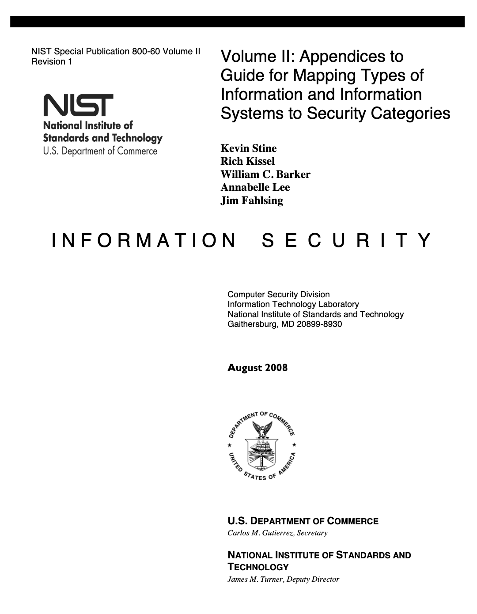

<!-- _paginate: false -->

# How do I OSCAL?
### 4th Annual OSCAL Conference Workshop
A.J. Stein & Nikita Wootten

<!--
Slide headings prefixed by an emoji follow the following legend:
- 🧩: This slide is an overview of a model
- 📝: This slide contains a live demonstration
-->

---

## ⚠️ Disclaimer

<!-- _class: workshop invert radialbg -->

All persons and organizations mentioned within this presentation are fictional and any resemblance to actual persons or organizations is unintended.

<!-- TODO: NIST disclaimer? -->

---

## Introduction

- [Who is the target audience of this talk?](#target-audience)
- [What are the key assumptions made for this talk?](#assumptions)
- [Who are we?](#who-are-we)
- [Environment setup](#environment-setup)
- [What is OSCAL?](#what-is-oscal)

---

### Target audience

In order to follow along we assume that you:

1. Basic experience writing code or data (JSON, XML, YAML) in text editors
1. Understanding of security requirements for your business or mission
1. Understanding of your system and the larger context of your projects


---

### But I'm not the target audience!

We also assume you may not have these experiences.

* "But I've never been a developer!"
* "But I've never been an assessor!"
* "But I've never done governance, risk, or compliance work at my job!"

---

### But I'm not the target audience! (continued)

That is OK, we are very happy you're here!

* In the present or future, you will use compliance and security tools that use OSCAL.
* Shared specifications may standardize information and behavior for multiple tools from different vendors.
* Changed tools and processes will impact your organization and work.

---

<!--
_footer: " How do I OSCAL? - 4th Annual OSCAL Conference Workshop"
_class: workshop shrink
-->

### Environment setup


In order to follow along you need:

1. A computer (macOS or Windows, Linux, patched and updated)
    - ⚠️ Windows users will require the [WSL backend](https://learn.microsoft.com/en-us/windows/wsl/install)
1. [Visual Studio Code](https://code.visualstudio.com/#alt-downloads)
1. [Docker Desktop](https://www.docker.com/products/docker-desktop/) if on macOS or Windows, [Docker Engine](https://docs.docker.com/engine/) if on Linux

📝 You do not have to follow along to learn from this presentation.

---

### Assumptions

<!-- _class: workshop invert radialbg -->

The goal of this presentation is to demonstrate *a* workflow showcasing how OSCAL and a GRC service *could* interact within your organization.

---

### Who are we?

<!-- TODO include some icons here -->

* Normally, we are part of the NIST OSCAL Team
* Today is special, we are the fictional IFA GoodRead Product Team
    * Developer - Developing the application
    * System Engineer - Deploying and maintaining the application in the system
* There are other actors in this organization important to this presentation:
    * System Owner
    * ISSO
    * Assessor

---

## The opening act (why are we here?)

IFA has tasked us to design, implement, and documenting this new system for this project, following the IFA software development lifecycle (SDLC).


IFA's Office of the CISO wants us to use OSCAL and report back on how it impacts the IFA SDLC.

---

### The project

- IFA needs to track policy publication
- A link shortener will help (let's call it **IFA GoodRead**)
- How will it work?
    - Staff log into GoodRead admin portal and insert a URL like  `https://www.ifa.gov/2023/04/19/request-for-comment-on-new-guidance-for-2023-fiscal-year`
    - The system will generate shortlink like `https://from.ifa.gov/2023rfc`
    - Staff can now **share the shortlink with the public** and get **metrics on the shortlink's usage**

---

## The valley of despair

- IFA has lots of mandatory policies and recommended processes
- Projects must start, change, or stop through the IFA SDLC
- Not just developers and engineers create and manage a system:
    - Technical and non-technical staff must frequently collaborate
    - They write about what they have and do in the project
    - They have to keep documentation current in long SDLC phases

---

## The valley of despair (continued)

* How did they do it before?
    - Staff created Microsoft Word and PDF documents
    - Colleagues reviewed and emailed draft feedback separately
    - Frequent meetings occurred to clear up ambiguities in documents
* Why didn't they like it before?
    - Data was unstructured and hard to manage
    - Quality checking across multiple documents was tedious
    - Quick status checks on development or operations were difficult

---

## The valley of despair (continued)

IFA staff were not so happy.

---


## Leaving the valley of despair (continued)

* How will the IFA GoodRead Team do it now?
    - They built a GRC program with a centralized service
    - Staff use near real-time web application or APIs
    - Decrease reliance on static Microsoft Word or PDF documents
* What does the IFA CISO office expect to happen now?
    - GRC has structured data for efficient analysis
    - Most of the tedious quality checking is done by GRC
    - GRC indicates status or progress on the system lifecyle

---

## The valley of despair (continued)

IFA staff are a little happier now.

---

## How could we leverage OSCAL as developers?

Although *each organization will use OSCAL differently*, it generally provides some key benefits we will demonstrate today:

- Developers can document systems with code, with all the benefits of modularization.
- GRC tools and services can exchange data with standard data models.
- Vendors can provide security information about their products in components.

---

## Let's try OSCAL

*A potential* OSCAL workflow framed within IFA's SDLC process: 

1. **Prepare** the project and its system
1. **Categorize** the system's data
1. **Select** controls for the system
1. **Implement** the system and its security
1. **Assess** system's security
1. **Authorize** the system for operation
1. **Monitor** the system

---

## Let's try OSCAL (continued)

1. **Prepare** the project and its system
    * Bootstrap OSCAL files with preparatory info
2. **Categorize** the system's data
    * Add system information types in OSCAL SSP
    * Add system categorization in OSCAL SSP

---

## Let's try OSCAL (continued)

3. **Select** controls for the system
    * Retrieve import profile for OSCAL SSP to identify selected controls
    * Generate resolved OSCAL catalog from OSCAL profile
4. **Implement** the system and its security
    * Add "this system" component in OSCAL SSP
    * Add control implementation in OSCAL
---

## Let's try OSCAL (continued)

5. **Assess** system's security
    * Retrieve OSCAL AP
    * Perform assessment activities in OSCAL AP
    * Create OSCAL AR documenting assessment activities  and results
    * Upload OSCAL AR to GRC
    * Create OSCAL POA&M and upload to GRC
6. **Authorize** the system for operation
    * Retrieve updated OSCAL SSP with authorization data
    * Deploy system

---

## Let's try OSCAL (continued)

7. **Monitor** the system
    * Review OSCAL POA&M and check if findings obsolete
    * Retrieve OSCAL AP for continuous monitoring steps
    * Perform continuous monitoring activities
    * Create OSCAL AR documenting activities, supporting evidence, and results
    * Create and update OSCAL POA&M if needed
---

<!--
_footer: " How do I OSCAL? - 4th Annual OSCAL Conference Workshop"
_class: workshop whitebg
-->

## What is OSCAL?

"OSCAL is a set of formats expressed in XML, JSON, and YAML. These formats provide machine-readable representations of **control catalogs**, **control baselines**, **system security plans**, and **assessment plans and results**."

---

<!--
_footer: " How do I OSCAL? - 4th Annual OSCAL Conference Workshop"
_class: workshop whitebg
-->

## What is OSCAL? (continued)

- OSCAL has three **layers** with seven **models** that define:
    - information structure supporting a specific operational purpose
    - relationships between data internal to a model and externally to other models
- OSCAL data that conforms to one of the models is a **document instance**
- Software checks that data conforms to the model with a **schema**

---

<!--
_footer: " How do I OSCAL? - 4th Annual OSCAL Conference Workshop"
_class: workshop whitebg

NOTE: So it's important we understand the models define how you structure your actual data, in the document instance. The IFA GoodRead system will have an OSCAL SSP (the document instance) that conforms to the OSCAL SSP Model. We use the schema to validate the document instance and check how it conforms to the SSP model.

-->


### OSCAL basics

OSCAL describes a set of *models* for documenting a system in machine readable formats (JSON, XML, YAML).


---

<!--
_footer: " How do I OSCAL? - 4th Annual OSCAL Conference Workshop"
_class: workshop whitebg
-->

#### How do we edit OSCAL content?


- Refer to the [OSCAL model documentation](https://pages.nist.gov/OSCAL/reference/latest/complete/) (pictured)
- Configure your editor to use OSCAL's [JSON/YAML](https://github.com/usnistgov/OSCAL/tree/d3a2b990e24210c253642451e30ea6db99bd045b/json/schema) and [XML](https://github.com/usnistgov/OSCAL/tree/d3a2b990e24210c253642451e30ea6db99bd045b/xml/schema) **schemas**.
    - ⚠️ OSCAL imposes additional constraints not represented within the schemas.

---

<!--
_footer: " How do I OSCAL? - 4th Annual OSCAL Conference Workshop"
_class: workshop whitebg
-->

#### Leveraging OSCAL tooling

OSCAL tools, such as the [oscal-cli](https://github.com/usnistgov/oscal-cli), provide additional functionality:

- Converting documents between formats (JSON, YAML, XML)
    ```
    $ oscal-cli profile convert basic-profile.json basic-profile.xml
    ```

- Validating OSCAL documents
    ```
    $ oscal-cli profile validate basic-profile.json
    ```

- Performing specific OSCAL operations (profile resolution)
    ```
    $ oscal-cli profile resolve basic-profile.json
    ```

---

### Prepare


---


### Categorize


---

### Categorize (continued)


---

<!--
_footer: " How do I OSCAL? - 4th Annual OSCAL Conference Workshop"
_class: workshop whitebg
-->

#### 🧩 The OSCAL system security plan (SSP) model


> An SSP describes the control implementation of an information system.

---

### Our Information Types



* Our system stores **links** created by members of IFA.
* Let's choose `C.2.8.12 General Information Information Type` from [NIST SP 800-60](https://csrc.nist.gov/publications/detail/sp/800-60/vol-2-rev-1/final)
* The ISSO reclassified the *integrity impact* from [FIPS-199](https://csrc.nist.gov/publications/detail/fips/199/final) **LOW** to **MODERATE**.

<!--
General Information Information Type is categorized as a:
- confidentiality low
- integrity low
- availability low

But in our system the integrity is a bit more impactful (imagine a malicious actor replacing well known links)
-->

---

#### 📝 Our basic SSP

[🔗 appendix slides](#appendix-a-our-starter-ssp)

<!--
Note: Live demo here

Create the basic SSP
-->

---

### Categorize (continued)


---

### Select controls


---

<!--
_footer: " How do I OSCAL? - 4th Annual OSCAL Conference Workshop"
_class: workshop whitebg
-->

### Select controls (continued)

Our ISSO selected a singular control, [AC-6(1)](https://csrc.nist.gov/projects/cprt/catalog#/cprt/framework/version/SP_800_53_5_1_0/home?element=AC-6):

"Employ the principle of least privilege, allowing only authorized accesses for users (or processes acting on behalf of users) that are necessary to accomplish assigned organizational tasks."

<!--
* Why select control AC-6(1)?
    * Measurable not only quantitatively, but qualitatively
    * Concrete, but broad enough to discuss across system elements in components
    * Relevant dimensions to administrative, technical, and physical controls relatable to technical or administrative staff, inside and outside IT roles
-->

---

<!--
_footer: " How do I OSCAL? - 4th Annual OSCAL Conference Workshop"
_class: workshop whitebg
-->

#### 🧩 The OSCAL catalog model


> A catalog describes a collection of security controls and related control enhancements, along with contextualizing documentation and metadata.

---

<!--
_footer: " How do I OSCAL? - 4th Annual OSCAL Conference Workshop"
_class: workshop whitebg
-->

#### 🧩 The OSCAL profile model


> A profile designates a selection and configuration of controls from one or more catalogs, along with a series of operations over them.

---

#### 📝 Our profile

<!--
Note: Live demo here

- Create a profile with our control selection
- Resolve the profile and examine the output catalog (if time permits)
- Update the SSP to use the new profile
-->

[🔗 appendix slides](#appendix-b-our-profile)

---

### Implement


---

#### IFA GoodReads: Defining the system


---

#### 📝 Our updated system security plan

<!--
Note: Live demo here

Update the SSP with our systems
-->

[🔗 appendix slides](#appendix-c-our-updated-system-security-plan)

---

### Assess: Plan


---

<!--
_footer: " How do I OSCAL? - 4th Annual OSCAL Conference Workshop"
_class: workshop whitebg
-->

#### 🧩 The OSCAL assessment plan model


> An assessment plan describes the information typically provided by an assessor during the preparation for an assessment.

---

#### 📝 Our assessment plan

<!--
Note: Live demo here

Create our basic assessment plan
-->

[🔗 appendix slides](#appendix-d-our-assessment-plan)

---

### Assess: generate results


---

<!--
_footer: " How do I OSCAL? - 4th Annual OSCAL Conference Workshop"
_class: workshop whitebg
-->

#### 🧩 The OSCAL assessment results model


> An assessment results document describes the information typically provided by an assessor following an assessment.

---

#### 📝 Our assessment results

<!--
Note: Live demo here

Go through an already created assessment results file
-->

[🔗 appendix slides](#appendix-e-our-assessment-results)

---

<!--
_footer: " How do I OSCAL? - 4th Annual OSCAL Conference Workshop"
_class: workshop whitebg
-->

#### 🤖 Opportunity for automation

<!--
The astute among you may be thinking: "I could generate evidence for assessment results in CI/CD pretty easily."

We agree! In a separate presentation we have explored this idea with a small GitHub actions workflow that generated assessment results automatically.
-->


Evidence generation for assessment results can be [automated with OSCAL](https://github.com/usnistgov/blossom-case-study).

---

### Assess: Generate Plan of Action and Milestones (POA&M)


---

<!--
_footer: " How do I OSCAL? - 4th Annual OSCAL Conference Workshop"
_class: workshop whitebg
-->

#### 🧩 The OSCAL plan of actions & milestones (POA&M) model


> A POA&M document describes the information typically provided by an assessor during the preparation for an assessment.

---

#### 📝 Our plan of action and milestones

<!--
Note: Live demo here

Create the POA&M
-->

[🔗 appendix slides](#appendix-f-our-plan-of-action-and-milestones)

---

### Assess: Finishing touches


---

### Authorize


---

### Continuously monitor


---

<!--
_footer: " How do I OSCAL? - 4th Annual OSCAL Conference Workshop"
_class: workshop whitebg
-->

#### 🌊 The flow of information
The models build on one-another iteratively


---

### Making OSCAL documents reusable


Our organization uses a lot of the same pieces across all of our applications (*AwesomeCloud Compute Server*, *Postgres*, etc)

How do we reuse the systems in other deployments?

---

<!--
_footer: " How do I OSCAL? - 4th Annual OSCAL Conference Workshop"
_class: workshop whitebg
-->

#### 🧩 The OSCAL component definition (CDEF) model


> A component definition describes the implementation of controls in a component or a set of components (technical or procedural) grouped as a capability.

*⚠️ NOTE: enhancements to the CDEF model are slated for future work*

---

#### 📝 Breaking our SSP into component definitions

<!--
Note: Live demo here

Create the CDEF, update the SSP to use the CDEF
-->

[🔗 appendix slides](#appendix-i-breaking-our-ssp-into-component-definitions)

---

<!-- _class: workshop invert radialbg -->

## What have we learned?

* 🧩 All of the OSCAL models and how they relate to one-another
* 📝 The basics of editing and validating OSCAL documents
* 🔍 Describing systems, security documentation, and assessment data with OSCAL

---

# 📚 Appendix

- [A](#appendix-a-our-starter-ssp): Our starter system security plan
- [B](#appendix-b-our-profile): Our profile
- [C](#appendix-c-our-updated-system-security-plan): Our updated system security plan
- [D](#appendix-d-our-assessment-plan): Our assessment plan
- [E](#appendix-e-our-assessment-results): Our assessment results
- [F](#appendix-f-our-plan-of-action-and-milestones): Our plan of action and milestones
- [G](#appendix-g-updating-the-ssp-after-authorization): Updating the SSP after authorization
- [H](#appendix-h-continuously-monitoring-the-system): Continuously monitoring the system
- [I](#appendix-i-breaking-our-ssp-into-component-definitions): Breaking our system security plan into component definitions

---

<!-- Footer excluded from remaining slides due to content -->
<!--footer: "" -->

## Appendix A: Our starter SSP

Let's start with a skeleton of an SSP and fill in some metadata:

```xml
<system-security-plan
  uuid="cff8385f-108e-40a5-8f7a-82f3dc0eaba8"
  xmlns="http://csrc.nist.gov/ns/oscal/1.0">
  <metadata>
    <title>IFA GoodReads SSP</title>
    <last-modified>2023-05-16T13:57:28.355446-04:00</last-modified>
    <version>1.0</version>
    <oscal-version>1.0.4</oscal-version>
    <!-- Must populate roles and parties -->
  </metadata>
  <!-- To fill in: -->
  <import-profile></import-profile>
  <system-characteristics></system-characteristics>
  <system-implementation></system-implementation>
  <control-implementation></control-implementation>
</system-security-plan>
```

---

### Appendix A.i: Our starter SSP's roles and parties

We use `<role>` and `<party>` in `<metadata>` to document the kinds of work in a project, the people who do it, and the organization they work for.


```xml
...
<role id="owner"><title>IFA GoodRead Owner</title></role>
<role id="developer"><title>IFA GoodRead Developer</title></role>
<role id="system-engineer"><title>IFA GoodRead System Engineer</title></role>
<role id="public-affairs-office"><title>IFA Public Affairs Office</title></role>
<party uuid="ba9c12bd-e5ef-46b6-95a2-4d8e7f864c1a" type="person">
    <name>Owen Owner</name>
    <member-of-organization>3a675986-b4ff-4030-b178-e953c2e55d64</member-of-organization>
</party>
<party uuid="67c04291-dbf6-495a-a3ba-0011638acc94" type="person">
    <name>Nikita Wootten</name>
    <member-of-organization>3a675986-b4ff-4030-b178-e953c2e55d64</member-of-organization>
</party>
<party uuid="4ba3f2b7-e894-48d7-b940-91c68661df55" type="person">
    <name>A.J. Stein</name>
    <member-of-organization>3a675986-b4ff-4030-b178-e953c2e55d64</member-of-organization>
</party>
<party uuid="3a675986-b4ff-4030-b178-e953c2e55d64" type="organization">
    <name>Important Federal Agency</name>
    <short-name>IFA</short-name>
    <link href="https://www.ifa.gov" rel="website"/>
</party>
<responsible-party role-id="owner">
    <party-uuid>ba9c12bd-e5ef-46b6-95a2-4d8e7f864c1a</party-uuid>
</responsible-party>
<responsible-party role-id="developer">
    <party-uuid>67c04291-dbf6-495a-a3ba-0011638acc94</party-uuid>
</responsible-party>
<responsible-party role-id="system-engineer">
    <party-uuid>4ba3f2b7-e894-48d7-b940-91c68661df55</party-uuid>
</responsible-party>
```

---

### Appendix A.ii: Our starter SSP's system characteristics

```xml
...
<system-characteristics>
    <system-id identifier-type="http://ietf.org/rfc/rfc4122">
        8101e04d-8305-4e73-bb95-6b59f645b143
    </system-id>
    <system-name>IFA GoodReads</system-name>
    <description>
        <p>This system acts as a link shortener for IFA employees</p>
    </description>
    <security-sensitivity-level>moderate</security-sensitivity-level> <!-- Determined by categorization -->
    <system-information>
        <!-- Detailed information types (next slide) -->
    </system-information>
    <security-impact-level> <!-- Determined by categorization -->
        <security-objective-confidentiality>low</security-objective-confidentiality>
        <security-objective-integrity>medium</security-objective-integrity>
        <security-objective-availability>low</security-objective-availability>
    </security-impact-level>
    <status state="under-development"></status>
    <authorization-boundary>
        <description>
            <p>This components deployed on AwesomeCloud</p>
        </description>
    </authorization-boundary>
</system-characteristics>
```

---

### Appendix A.iii: Our starter SSP's system information types

In `<system-information>` we document the information types (as defined in [FIPS-199](https://nvlpubs.nist.gov/nistpubs/fips/nist.fips.199.pdf)) present in the system.

```xml
...
<system-information>
    <information-type>
        <title>User-provided Links</title>
        <description>
            <p>This system maintains a set of user-provided links and their associated shortlinks</p>
        </description>
        <categorization system="https://doi.org/10.6028/NIST.SP.800-60v2r1">
            <information-type-id>C.2.8.12</information-type-id>
        </categorization>
        <confidentiality-impact>
            <base>fips-199-low</base>
        </confidentiality-impact>
        <integrity-impact>
            <base>fips-199-low</base>
            <selected>fips-199-moderate</selected>
            <adjustment-justification>
                <p>Maliciously modified links are a concern</p>
            </adjustment-justification>
        </integrity-impact>
        <availability-impact>
            <base>fips-199-low</base>
        </availability-impact>
    </information-type>
</system-information>
```

---

### Appendix A.iv: Our starter SSP (conclusion)

In this demonstration we have:
- Created a minimal SSP in OSCAL
- Discussed the `<metadata>` object
- Documented our system's `roles` and `parties`
- Documented the information types in our system and their categorization

⚠️ The SSP in its current state is invalid! We must fill it out with information given in later steps.

[⏪ Back to the presentation](#our-basic-ssp)

---

## Appendix B: Our profile

Profiles import and tailor controls from one or more catalogs.

```json
{
    "profile": {
        "uuid": "ada8fb2f-ba03-46b6-a695-35763beed453",
        "metadata": {
            "title": "IFA GoodReads Profile",
            "last-modified": "2023-05-17T13:57:28.355446-04:00",
            "version": "1.0",
            "oscal-version": "1.0.4"
        },
        "imports": [
            {
                // URL shortened for brevity (if only we had a link shortener!)
                "href":
"https://raw.githubusercontent.com/.../NIST_SP-800-53_rev5_MODERATE-baseline-resolved-profile_catalog.json",
                "include-controls": [
                    {
                        "with-ids": [
                            "ac-6.1"
                        ]
                    }
                ]
            }
        ],
        "merge": {
            "flat": {}
        }
    }
}
```

---

### Appendix B.i: Our profile can be resolved into a catalog

Through a process known as *profile resolution*, profile authors can turn a profile into a *resolved catalog*:

```
oscal-cli profile resolve profile.oscal.json
```

Which produces:

```json
{
    "catalog" : {
        "uuid" : "30013927-fb24-4e03-bc15-8d9df5e17a25",
        "metadata" : {
            "title" : "IFA GoodReads Profile"
            // ...
        },
        "controls": [ {
            "id": "ac-6.1",
            "class" : "SP800-53-enhancement",
            "title" : "Authorize Access to Security Functions",
            "params" : [ {
                "id" : "ac-6.1_prm_2",
                "label" : "organization-defined security functions (deployed in hardware, software, and firmware)"
            // ... rest of the control omitted
}]}]}} // sorry
```

---

### Appendix B.ii: Our profile can be imported by our SSP

Our SSP imports the profile we just created:

```xml
<system-security-plan
    uuid="cff8385f-108e-40a5-8f7a-82f3dc0eaba8"
    xmlns="http://csrc.nist.gov/ns/oscal/1.0">
    ...
    <import-profile href="./profile.oscal.json"/>
    ...
</system-security-plan>
```

📝 Notice that the SSP and profiles use JSON and XML interchangeably.

---

### Appendix B.iii: Our profile (conclusion)

In this demonstration we have:
- Created a profile with our selected controls
- Explored profile resolution and the process of creating a "resolved catalog"
- Demonstrated OSCAL's inter-format compatibility
- Updated our SSP to import the profile

⚠️ The SSP is still incomplete and missing crucial details about our system. We will finish creating the SSP in the next step.

[⏪ Back to the presentation](#our-profile)

---

## Appendix C: Our updated system security plan

Our system security plan is missing crucial details about our system, namely:
- `<system-implementation>`: Define how the system is implemented
    - `<user>`*s*: Define the users that interact with a system based on an associated `<role>`
    - `<component>`*s*: Define the components that make up an implemented system
- `<control-implementation>`: Describes how the system satisfies a set of controls

---

### Appendix C.i: Our updated SSP's system users

The first user type of our system is the general public, who are free only to view a shortlink.

```xml
...
<system-implementation>
    <user uuid="fb36760a-143d-490b-8fc4-6a8c172fba86">
        <title>General Public</title>
        <description>
            <p>The general public is free to click on shortlinks</p>
        </description>
        <authorized-privilege>
            <title>General Public Privilege</title>
            <function-performed>shortlink-view</function-performed>
        </authorized-privilege>
    </user>
</system-implementation>
```

---

### Appendix C.ii: Our updated SSP's system users (continued)

```xml
...
<user uuid="00d323d3-dc3f-4d93-900f-f13430e094d3">
    <title>Application Administrator</title>
    <description>
        <p>The developer of the application supports IFA Public Affairs Officers by
        administering the application and its infrastructure.</p>
    </description>
    <role-id>developer</role-id>
    <authorized-privilege>
        <title>Application Administrator Privilege</title>
        <function-performed>user-creation</function-performed>
        <function-performed>user-enablement</function-performed>
        <function-performed>user-disablement</function-performed>
        <function-performed>user-role-modification</function-performed>
        <function-performed>popular-shortlink-cache-reset</function-performed>
        <function-performed>database-export</function-performed>
        <function-performed>database-migration</function-performed>
    </authorized-privilege>
</user>
<user uuid="61405ba7-edb4-4243-8461-79aac5805e5c">
    <title>Public Affairs Officers</title>
    <description>
        <p>IFA Public Affairs Officers (PAOs) in each division of the agency review public communications to citizens who are customers of the IFA.
        PAOs review requests from colleagues to generate and publish content that is the target of a shortlink and can un-publish shortlinks.</p>
    </description>
    <role-id>public-affairs-office</role-id>
    <authorized-privilege>
        <title>Public Affairs Officer Privilege</title>
        <function-performed>shortlink-generation</function-performed>
        <function-performed>shortlink-approval</function-performed>
        <function-performed>shortlink-rejection</function-performed>
        <function-performed>shortlink-publication</function-performed>
        <function-performed>shortlink-unpublication</function-performed>
    </authorized-privilege>
</user>
```

---

### Appendix C.iii: Our updated SSP's system component

For now, let's define our system as a single component.

```xml
...
<component uuid="551b9706-d6a4-4d25-8207-f2ccec548b89" type="this-system">
    <title>IFA GoodRead System</title>
    <description>
        <p>IFA develops, operates, and maintains the GoodRead link shortener system to </p>
    </description>
    <status state="under-development"/>
    <responsible-role role-id="developer">
        <party-uuid>67c04291-dbf6-495a-a3ba-0011638acc94</party-uuid>
    </responsible-role>
    <responsible-role role-id="system-engineer">
        <party-uuid>4ba3f2b7-e894-48d7-b940-91c68661df55</party-uuid>
    </responsible-role>
</component>
...
```

---

### Appendix C.iv: Our updated SSP's system inventory

Let's define inventory items that are part of the "this-system" component.

```xml
...
<inventory-item uuid="4392599a-9117-416a-87d1-24c7d1b2dd0b">
    <description>
        <p>This is the custom GoodRead application within the system.</p>
    </description>
    <prop class="webserver-application" name="software-name" value="IFA GoodRead"/>
    <prop class="webserver-application" name="software-version" value="1.0.0"/>
    <prop class="webserver-application" name="vendor-name" value="Important Federal Agency"/>
    <prop class="webserver-application" name="asset-id" value="IFAGOV-SYSTEM1234-GOODREAD"/>
    <implemented-component component-uuid="551b9706-d6a4-4d25-8207-f2ccec548b89"/>
</inventory-item>
...
```

---

### Appendix C.v: Our updated SSP's control implementation

Now we document the control implementation.

```xml
...
<control-implementation>
    <description>
        <p>...</p>
    </description>
    <implemented-requirement
        uuid="d5f9b263-965d-440b-99e7-77f5df670a11"
        control-id="ac-6.1">
        <by-component
            component-uuid="551b9706-d6a4-4d25-8207-f2ccec548b89"
            uuid="a4c2d318-26a9-49df-9818-ee0acaf066f2">
            <description>
                <p>...</p>
            </description>
    </implemented-requirement>
</control-implementation>
...
```

---

### Appendix C.vi: Our updated system security plan (conclusion)

In this demonstration we have:
- Documented our system using the `<system-implementation>` part of our SSP.
- Documented how our system implements controls using the `<control-implementation>` part of our SSP.

✅ Our SSP now adequately describes our system and is considered *valid*.

[⏪ Back to the presentation](#our-updated-system-security-plan)

---

## Appendix D.i: Our assessment plan

First, we set up the initial AP with the metadata and SSP import.

```xml
...
<metadata>
        <role id="assessor">
            <title>IFA Security Control Assessor</title>
        </role>
        <party uuid="e7730080-71ce-4b20-bec4-84f33136fd58" type="person">
            <name>Amy Assessor</name>
            <member-of-organization>3a675986-b4ff-4030-b178-e953c2e55d64</member-of-organization>
        </party>
        <party uuid="3a675986-b4ff-4030-b178-e953c2e55d64" type="organization">
            <name>Important Federal Agency</name>
            <short-name>IFA</short-name>
            <link href="https://www.ifa.gov" rel="website"/>
        </party>
        <responsible-party role-id="assessor">
            <party-uuid>e7730080-71ce-4b20-bec4-84f33136fd58</party-uuid>
        </responsible-party>
</metadata>
<import-ssp href="../3-implementation/ssp.oscal.xml"/>
...
```

---

## Appendix D.ii: Our assessment plan (continued)

Next we add the local definition with the assessment activity and steps.

```xml
...
<local-definitions>
    <activity uuid="52277182-1ba3-4cb6-8d96-b1b97aaf9d6b">
        <title>Activity 1</title>
        <description><p>...</p></description>
        <prop name="method" value="EXAMINE"/>
        <step uuid="733e3cbf-e398-46b6-9c02-a2cb534c341e">
            <title>Step 1</title>
            <description><p>...</p></description>
        </step>
        <related-controls>
            <control-selection><include-control control-id="ac-6.1"/></control-selection>
        </related-controls>
        <responsible-role role-id="assessor">
            <party-uuid>e7730080-71ce-4b20-bec4-84f33136fd58</party-uuid>
        </responsible-role>
    </activity>
</local-definitions>
...
```

---

## Appendix D.iii: Our assessment plan (continued)

Then we define the scope of controls, subjects, and tasks of the assessment.

```xml
...
<reviewed-controls>
    <control-selection>
        <include-control control-id="ac-6.1"/>
    </control-selection>
    <control-objective-selection>
        <include-all/>
    </control-objective-selection>
</reviewed-controls>
<assessment-subject type="component">
    <description><p>...</p></description>
    <include-all/>
</assessment-subject>
<task uuid="b3504d22-0e75-4dd7-9247-618661beba4e" type="action">
    <title>Task 1</title>
    <associated-activity activity-uuid="0d243b23-a889-478f-9716-6d4870e56209">
        <subject type="component">
            <include-all/>
        </subject>
    </associated-activity>
</task>
...
```

---

### Appendix D.iv: Our assessment plan (conclusion)

In this demonstration we have:
- Created an AP, added assessor information, and linked to the system SSP.
- Staged information about activities and their steps in the `<local-definitions`>.
- Scoped the assessment's controls, system, and activity scope involved in the `<reviewed-controls>`, `<assessment-subject>`, and `<task>` respectively.

✅ We have now documented our assessment plans and the AP is *valid*.

[⏪ Back to the presentation](#our-assessment-plan)

---

## Appendix E.i: Our assessment results

Set up the initial assessment results (AR) with metadata and assessment plan (AP) import.

```xml
...
    <role id="assessor">
        <title>IFA Security Control Assessor</title>
    </role>
    <party uuid="e7730080-71ce-4b20-bec4-84f33136fd58" type="person">
        <name>Amy Assessor</name>
        <member-of-organization>3a675986-b4ff-4030-b178-e953c2e55d64</member-of-organization>
    </party>
    <party uuid="3a675986-b4ff-4030-b178-e953c2e55d64" type="organization">
        <name>Important Federal Agency</name>
        <short-name>IFA</short-name>
        <link href="https://www.ifa.gov" rel="website"/>
    </party>
    <responsible-party role-id="assessor">
        <party-uuid>e7730080-71ce-4b20-bec4-84f33136fd58</party-uuid>
    </responsible-party>
</metadata>
<import-ap href="./ap.oscal.xml"/>
...
```

---

### Appendix E.ii: Our assessment results (continued)

Copy the activity steps `<local-definitions>` from the AP with current status.

```xml
...
<local-definitions>
    <activity uuid="52277182-1ba3-4cb6-8d96-b1b97aaf9d6b">
        ...
        <step uuid="733e3cbf-e398-46b6-9c02-a2cb534c341e">
            <title>Step 1</title>
            <description><p>...</p></description>
            <!-- Addition below -->
            <remarks>
                <p>GoodRead Team set up account for assessor</p>
            </remarks>
            <!-- Addition above -->
        </step>
        ...
    </activity>
</local-definitions>
...
```

---

### Appendix E.iii: Our assessment results (continued)

We add the placeholder result with a start time to indicate the assessment started because the assessor received credentials from the product team.

```xml
...
<result uuid="e621a431-8eba-4ac7-90cd-ef96e5d90884">
    <title>IFA GoodRead Pre-Authorization Assessment Result 1</title>
    <description>
        <p>This will be the first result once the assessor has completed their final analysis in the assessment.</p>
    </description>
    <start>2023-05-19T10:49:20-04:00</start>
    <reviewed-controls>
        <control-selection>
            <include-control control-id="ac-6.1"/>
        </control-selection>
    </reviewed-controls>
</result>
...
```

---

### Appendix E.iv: Our assessment results (continued)

We now create a result with all the task and its activities completed.

```xml
...
<result uuid="fc2a3fda-bb39-4d83-9d39-f2d0e6f0af64">
    <title>IFA GoodRead Pre-Authorization Assessment Result 1</title>
    <description>
        <p>This will be the first result once the assessor has completed their final analysis in the assessment.</p>
    </description>
    <start>2023-05-19T10:49:20-04:00</start>
    <end> 2023-05-19T14:35:20-04:00</end>
...
```

---

### Appendix E.v: Our assessment results (continued)

We now embed the local-definitions in the result with associated activities and elements of the system.

```xml
...
<local-definitions>
    <assessment-task uuid="061b6942-f0d4-439c-9d74-92e779992845" type="action">
        <title>...</title>
        <description><p>...</p></description>
        <associated-activity activity-uuid="52277182-1ba3-4cb6-8d96-b1b97aaf9d6b">
            <subject type="inventory-item">
                <include-subject subject-uuid="d9550535-40b9-4d8b-861c-07aa8786bf43" type="inventory-item"/>
            </subject>
        </associated-activity>
        ...
    </assessment-task>
</local-definitions>
...
```

---

### Appendix E.vi: Our assessment results (continued)

Then we need to indicate the scope of controls for this result (the same as the AP in this case).

```xml
...
<reviewed-controls>
    <control-selection>
        <include-control control-id="ac-6.1"/>
    </control-selection>
</reviewed-controls>
...
```

---

### Appendix E.vii: Our assessment results (continued)

After the control scope, we need to add observations of everything seen during the assessment, whether or not it is a finding with a risk. That's later.

```xml
...
<observation uuid="0c4de4fc-9bde-46af-b6fe-3b5e78194dcf">
    <title>Django Framework Examination</title>
    <description>
        <p>...</p>
    </description>
    <method>EXAMINE</method>
    <type>control-objective</type>
    <subject subject-uuid="551b9706-d6a4-4d25-8207-f2ccec548b89" type="component"/>
    <collected>2023-05-19T12:14:16-04:00</collected>
    <remarks>
        <p>...</p>
    </remarks>
</observation>
...
```

---

### Appendix E.viii: Our assessment results (continued)

We complete the result by linking the unsatisfactory observation to a finding and risk.

```xml
...
    <risk uuid="8b8bae66-b28c-4fa5-9a20-b79e7322fc00">
        <title>PAO Staff Have Over-Privileged Access to GoodRead System</title>
        <description><p>...</p></description>
        <statement><p>...</p></statement>
        <status>investigating</status>
    </risk>
    <finding uuid="74155124-9b75-4bbd-b78f-ba3d8c2532b5">
        <title>Django Framework Admin Panel Not Disabled</title>
        <description><p>...</p></description>
        <target type="objective-id" target-id="ac-6.1_obj">
            <description><p>This is a finding.</p></description>
            <status state="not-satisfied"></status>
        </target>
        <implementation-statement-uuid>d5f9b263-965d-440b-99e7-77f5df670a11</implementation-statement-uuid>
        <related-observation observation-uuid="0c4de4fc-9bde-46af-b6fe-3b5e78194dcf"/>
        <associated-risk risk-uuid="8b8bae66-b28c-4fa5-9a20-b79e7322fc00" />
    </finding>
</result>
...
```

---

### Appendix E.ix: Our assessment results (conclusion)

In this demonstration we have:
- Create a staging assessment results (AR) document instance with:
    - Copies of the local definition activity and steps
    - A placeholder result to identify when task activities start
- Create a finalized AR with:
    - Updated result with a proper description, start time, and end time
    - Observations from the assessment
    - Findings and risks for the unsatisfactory observations

✅ We have now documented our assessment and the AR is *valid*.

[⏪ Back to the presentation](#our-assessment-results)

---

## Appendix F: Our plan of action and milestones

First, we must initialize the POA&M with the metadata, SSP of the related system, and the system identifier.

```xml
...
<metadata>
    <title>IFA GoodRead Plan of Action and Milestones</title>
    <last-modified>2023-05-19T12:57:08-04:00</last-modified>
    <version>1.0</version>
    <oscal-version>1.0.4</oscal-version>
</metadata>
<import-ssp href="../3-implementation/ssp.oscal.xml"/>
<system-id identifier-type="http://ietf.org/rfc/rfc4122">8101e04d-8305-4e73-bb95-6b59f645b143</system-id>
...
```

---

### Appendix F.i: Our POA&M (continued)

We then copy the relevant observation from the AR. Those reading the POA&M may not have access to the AP and AR for this context.

```xml
...
<observation uuid="0c4de4fc-9bde-46af-b6fe-3b5e78194dcf">
    <title>Django Framework Examination</title>
    <description><p>...</p></description>
    <method>EXAMINE</method>
    <type>control-objective</type>
    <subject subject-uuid="551b9706-d6a4-4d25-8207-f2ccec548b89" type="component"/>
    <collected>2023-05-19T12:14:16-04:00</collected>
    <remarks>
        <p>...</p>
    </remarks>
</observation>
...
```

---

### Appendix F.ii: Our POA&M (continued)

We then copy over and enhance the risk previously reported in the AR into the POA&M. We annotate that its determination, mitigations, and timings.

```xml
...
<risk uuid="d4b8b48b-9c27-4cf7-afe4-11203bfa0420">
    <title>...</title>
    <description><p>...</p></description>
    <statement><p>...</p></statement>
    <status>deviation-approved</status>
    <characterization><origin><actor type="party" actor-uuid="e7730080-71ce-4b20-bec4-84f33136fd58"/></origin></characterization>
    <mitigating-factor uuid="401c15c9-ad6b-4d4a-a591-7d53a3abb3b6">
        <description><p>...</p></description>
    </mitigating-factor>
    <deadline>2024-01-01T05:00:00-04:00</deadline>
    <response uuid="d28873f7-0a45-476d-9cd3-1d2ec0b8bca1" lifecycle="planned">
        <title>...</title>
        <description><p>...</p></description>
        <prop name="type" value="accept"/>
        <task uuid="f8b1d4cb-d1a9-4932-9859-2e93b325f287" type="milestone">
            <title>...</title>
            <description><p>...</p></description>
            <timing><within-date-range start="2023-09-29T09:00:00-04:00" end="2024-01-01T05:00:00-04:00"/></timing>
        </task>
    </response>
    <related-observation observation-uuid="0c4de4fc-9bde-46af-b6fe-3b5e78194dcf"/>
</risk>
...
```

---

### Appendix F.iii: Our POA&M (continued)

Finally, we must define the POA&M item derived from the accepted risk until it is mitigated.

```xml
...
<poam-item uuid="e174dfb9-0ae3-4a8f-8e7c-081527b84337">
    <title>...</title>
    <description>
        <p>...</p>
    </description>
    <related-observation observation-uuid="0c4de4fc-9bde-46af-b6fe-3b5e78194dcf"/>
    <associated-risk risk-uuid="401c15c9-ad6b-4d4a-a591-7d53a3abb3b6" />
</poam-item>
...
```

---

### Appendix F.iv: Our POA&M (conclusion)

In this demonstration we have:
- Created a POA&M with initial metadata and linkage to its SSP
- Copied over the subset of relevant observations related to risks
- Copied over and enhanced risks with additional details, determination, and timings for risk response
- Created a POA&M item to track how the observed risk is mitigated and by when

✅ We have our POA&Ms and the document instance is *valid*.

[⏪ Back to the presentation](#our-plan-of-action-and-milestones)

---

## Appendix G: Updating the SSP after authorization

We now have implemented and assessed the system. Congrats! We need to update the SSP to indicate it is authorized.

---

### Appendix G.i: Updating the SSP after authorization (continued)

We add the authorization date in the system characteristics.

```xml
...
<system-characteristics>
    <system-id identifier-type="http://ietf.org/rfc/rfc4122">8101e04d-8305-4e73-bb95-6b59f645b143</system-id>
    <system-name>IFA GoodRead</system-name>
    <description>
        <p>This system acts as a link shortener for IFA employees</p>
    </description>
    <!-- Addition below -->
    <date-authorized>2023-05-19</date-authorized>
    <!-- Addition above -->
    <security-sensitivity-level>moderate</security-sensitivity-level>
...
```

---

### Appendix G.ii: Updating the SSP after authorization (continued)

Second, we update the system status to operational.

```xml
<system-characteristics>
    <system-id identifier-type="http://ietf.org/rfc/rfc4122">8101e04d-8305-4e73-bb95-6b59f645b143</system-id>
    <system-name>IFA GoodRead</system-name>
    <description><p>This system acts as a link shortener for IFA employees</p></description>
    <date-authorized>2023-05-19</date-authorized>
    ...
    <security-impact-level>
    ...
    </security-impact-level>
    <!-- Addition below -->
    <status state="operational"/>
    <!-- Addition above -->
    <authorization-boundary>
...
```

---

### Appendix G.iii: Updating the SSP after authorization (continued)

Finally, we update system components' status to operational. (For now, we only have one.)

```xml
...
<system-implementation>
    ...
    <component uuid="551b9706-d6a4-4d25-8207-f2ccec548b89" type="this-system">
        <title>IFA GoodRead System</title>
        <description>
            <p>IFA develops, operates, and maintains the GoodRead link shortener system to </p>
        </description>
        <!-- Addition below -->
        <status state="operational"/>
        <!-- Addition above -->
        <responsible-role role-id="developer">
            <party-uuid>67c04291-dbf6-495a-a3ba-0011638acc94</party-uuid>
        </responsible-role>
...
```

---

### Appendix G.iv: Updating the SSP after authorization (continued)

In this demonstration we have:
- Updated the SSP with the authorization date
- Updated system status to an operational state
- Updated system's component status to an operational state

✅ We have the SSP for authorized system and it is *valid*.

[⏪ Back to the presentation](#our-plan-of-action-and-milestones)

---

## Appendix H: Continuously monitoring the system

Now that we have an authorized system, we need to manage continuous monitoring (ConMon) with a workflow.

* Review and update POA&M items (if after the first iteration)
* Define the ConMon plan in an OSCAL AP
* Begin the ConMon process and add updates to an OSCAL AR
* When complete, finalize the OSCAL AR with open findings
* Create or update the OSCAL POA&M with findings and risks
* Rinse and repeat for the next ConMon iteration

---

### Appendix H.i: Continuously monitoring the system (continued)

First we will do familiar steps to create an OSCAL AP. We set up the ConMon AP with the metadata and the SSP for the authorized system.

```xml
...
<metadata>
    ...
    <role id="assessor"><title>IFA Security Controls Assessor</title></role>
    <party uuid="e7730080-71ce-4b20-bec4-84f33136fd58" type="person">
        <name>Amy Assessor</name>
        <member-of-organization>3a675986-b4ff-4030-b178-e953c2e55d64</member-of-organization>
    </party>
    <party uuid="3a675986-b4ff-4030-b178-e953c2e55d64" type="organization">
        <name>Important Federal Agency</name>
        <short-name>IFA</short-name>
        <link href="https://www.ifa.gov" rel="website"/>
    </party>
    <responsible-party role-id="assessor">
        <party-uuid>e7730080-71ce-4b20-bec4-84f33136fd58</party-uuid>
    </responsible-party>
</metadata>
<import-ssp href="../5-authorize/ssp.oscal.xml"/>
...
```

---

### Appendix H.ii: Continuously monitoring the system (continued)

In ConMon, we will testing the same control but with a slightly different activity and steps in the local definitions and scoping info.

```xml
...
<local-definitions>
    <activity uuid="cf5d53fe-6043-4c68-9ed6-6b258909febf">
        <title>Test System Elements for Least Privilege Design and Implementation</title>
        <description><p>...</p></description>
        <prop name="method" value="TEST"/>
        <step uuid="57f8cfb8-fc3f-41d3-b938-6ab421c92574">
            <title>Configure Cross-Account IAM Role Trust for GoodRead and Assessor AwesomeCloud Accounts</title>
            <description><p>...</p></description>
        </step>
        <step uuid="976aadad-b1ce-475b-aa6c-e082537e7902">
            <title>Automate Cross-Account Login to GoodRead AwesomeCloud Account</title>
            <description><p>...</p></description>
        </step>
        <step uuid="18ce4e19-7432-4484-8e75-2dd8f05668cf">
            <title>Analyze GoodRead Developer and System Engineer Roles for Least Privilege</title>
            <description><p>...</p></description>
        </step>
        <related-controls>
            <control-selection>
                <include-control control-id="ac-6.1"/>
            </control-selection>
        </related-controls>
        <responsible-role role-id="assessor">
            <party-uuid>e7730080-71ce-4b20-bec4-84f33136fd58</party-uuid>
        </responsible-role>
    </activity>
</local-definitions>
...
```

---

### Appendix H.iii: Continuously monitoring the system (continued)

After this, we need to complete the ConMon AP with the necessary control scope, tasks, and assessment subject just like with an assessment.

([Click here](#appendix-diii-our-assessment-plan-continued) to review this demo, it is extremely similar.)

---

### Appendix H.iv: Continuously monitoring the system (continued)

We now need to create an AR for this POA&M cycle iteration.

* [We create the with initial metadata AP import](#appendix-ei-our-assessment-results)
* [We copy over the locally-defined AP data as needed](#appendix-eii-our-assessment-results-continued)
* [Add the placeholder result with assessment start time](#appendix-eiii-our-assessment-results-continued)
* [Add the placeholder result with assessment start time](#appendix-eiv-our-assessment-results-continued)
* Finalize the AR with completed result with all objectives, findings, and risks like before in [1](#appendix-ev-our-assessment-results-continued), [2](#appendix-evi-our-assessment-results-continued), [3](#appendix-evii-our-assessment-results-continued), [4](#appendix-eviii-our-assessment-results-continued), and [5](#appendix-eix-our-assessment-results-conclusion)
---

### Appendix H.v: Continuously monitoring the system (continued)

In ConMon, we still use the POA&M to communicate findings, their risks, and how to manage them. We create a new POA&M instance or (more realistically) update the pre-existing one with new findings.

We follow the same steps we follow with making a POA&M instance for assessment, following [1](#appendix-f-our-plan-of-action-and-milestones), [2](#appendix-fi-our-poam-continued), [3](#appendix-fii-our-poam-continued), [4](#appendix-fiii-our-poam-continued), and [5](#appendix-fiv-our-poam-conclusion).

---

### Appendix H.vi: Continuously monitoring the system (continued)

In this demonstration we have:
- Examined the similarities of assessment to continuous monitoring
- Designed a plan for automated ConMon testing using the familiar AP to AR to POA&M workflow

✅ We now have an example of a continuous monitoring cycle and the AP, AR, and POA&M documents created are *valid*.

[⏪ Back to the presentation](#breaking-our-ssp-into-component-definitions)

---

## Appendix I.?: Breaking our SSP into component definitions

TODO

---

### Appendix I.?: Breaking our SSP into component definitions (conclusion)

In this demonstration we have:
- TODO

[⏪ Back to the presentation](#breaking-our-ssp-into-component-definitions)
