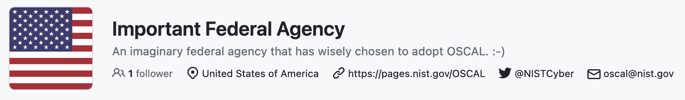

<!-- _paginate: false -->

# How do I OSCAL?
### 4th Annual OSCAL Conference Workshop
A.J. Stein & Nikita Wootten

---

## Disclaimer

All persons and organizations mentioned within this presentation are fictional and any resemblance to actual persons or organizations is purely coincidental.

<!-- TODO: NIST disclaimer? -->

---

## Introduction

* [Who is the target audience of this talk?](#target-audience)
* [What are the key assumptions made for this talk?](#assumptions)
* [Who are we?](#who-are-we)

---

### Target audience

In order to follow along we assume that you:

1. Basic experience writing code or data (JSON, XML, YAML) in text editors
1. Understanding of security requirements for your business or mission
1. Understanding of your system and larger environment

<!-- TODO insert a blurb here reassuring people not in this audience they can also follow along -->

---

### Assumptions

The goal of this presentation is to demonstrate *a* workflow showcasing how OSCAL and GRC tools *could* interact within your organization.

<!-- TODO -->

---

### Who are we?

<!-- TODO include some icons here -->

* Developer - Designing the application
* System Engineer - Deploying and maintaining the application

---

### Environment setup

In order to follow along:

1. A computer (macOS or Windows, Linux, patched and updated)
    1. Windows users will require the [WSL backend](https://learn.microsoft.com/en-us/windows/wsl/install)
1. [Visual Studio Code](https://code.visualstudio.com/#alt-downloads)
1. [Docker Desktop](https://www.docker.com/products/docker-desktop/) if on macOS or Windows, [Docker Engine](https://docs.docker.com/engine/) if on Linux

You do not have to follow along to learn from this presentation.

---

## The inciting incident

Our fictional organization, IFA, has chosen to adopt OSCAL on a new project key to the wellbeing of the public.

We have been tasked with designing and documenting this new system.

---

### The project

* Important Federal Agency needs a link shortener (IFA GoodRead)
* How will it work?
    * Staff log into GoodRead admin portal
    * Take a URL like `https://www.ifa.gov/2023/04/19/request-for-comment-on-new-guidance-for-2023-fiscal-year`
    * Generate a short link like `https://from.ifa.gov/2023rfc`
    * Share short link with public
    * Track audience metric from short link usage

---

## The valley of despair

* IFA has lots of policies and processes
* Systems must start, change, or stop through SDLC
* Not just developers create and manage a system
    * Technical and non-technical staff collaboration is crucial
    * They write about what they have and do
    * They have to keep it current during long development cycles

---

## The valley of despair

* How did they do it before?
    * Staff created Microsoft Word and PDF documents
    * Colleagues reviewed individually, made comments, emailed draft feedback
    * Frequent meetings occurred to clear up ambiguities in documents
* Why didn't they like it before?
    * Data was unstructured and hard to manage
    * Quality checking across multiple related documents was labor intensive
    * Quick spot check of system development or operation difficult
<!--
TODO: Create the following slides:
1. How roles interact when documentation is unstructured
2. How roles interact when GRC tooling is not interoperable
-->

---

## The valley of despair

IFA staff were not so happy.

---

## Leaving the valley of despair

* How do they do it now?
    * They built a GRC program with a centralized service
    * Staff use web application or APIs
    * Little reliance on Microsoft Word or PDF documents
* What do they like about it now?
    * GRC service has structured data for efficient analysis
    * Most quality checking is done by GRC
    * GRC indicates status or progress on the system lifecyle

---

## The valley of despair

IFA staff are a little happier now.

---

## How could we use OSCAL?

* Developers save it with code, like code
* Developers upload and download data with a GRC API
* Exchange data between different GRC services
* Vendors provide security information about their products in components

<!--
TODO: Create the following slides:
How do those roles collaborate with OSCAL? (*a* way they interact, this is not prescriptive)
    1. Developers write SSP store in VCS (GitHub)
    1. VCS copy of SSP uploaded to GRC tool
    1. ISSM reviews in GRC tool
    1. During assessment, assessors send AP to AO/ISSM/developer
    1. Devs submit evidence to assessors in AR against AP in GRC tool
-->

---

## Let's try OSCAL

<!--
5. A new hope (let's try OSCAL) (the bulk of the presentation)
    1. Setup (write metadata with name, party, contact info)
    1. Introduce the application (link shortener)
    2. Describe the system (deployment)
    1.Pick the controls
        * Retrieve a list of controls from our ITSO (from GRC Tool manager for ITSO's office)
        * Perform profile resolution and retrieve derived catalog
        * Compare the output resolved catalog (describe the utility)
    1. Describe the system
        * Review the system (what controlled by who)
        * Perform validation
    1. Write about the system in the SSP
        * Introduce automation with GHA?
    1. Assess the system in the SSP, GRC drops AR
    1. Devs review AR and create POA&M
    1. GRC tool checks POA&M and AR for updates
6. Conclusion (bring back the word document, compare the benefits)
-->

---

### Prepare

---

### Categorize

---

### Select controls

---

### Implement

---

### Assess: Plan

---

### Assess: Generate Results

---

#### Opportunity for automation

Assessment results generation can be automated with OSCAL.

---

### Assess: Generate Plan of Action and Milestones (POA&M)

---

### Assess: Finishing touches

---

### Authorize

---

### Continuously monitor

