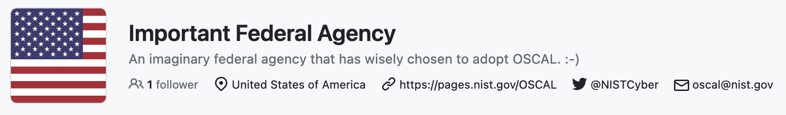
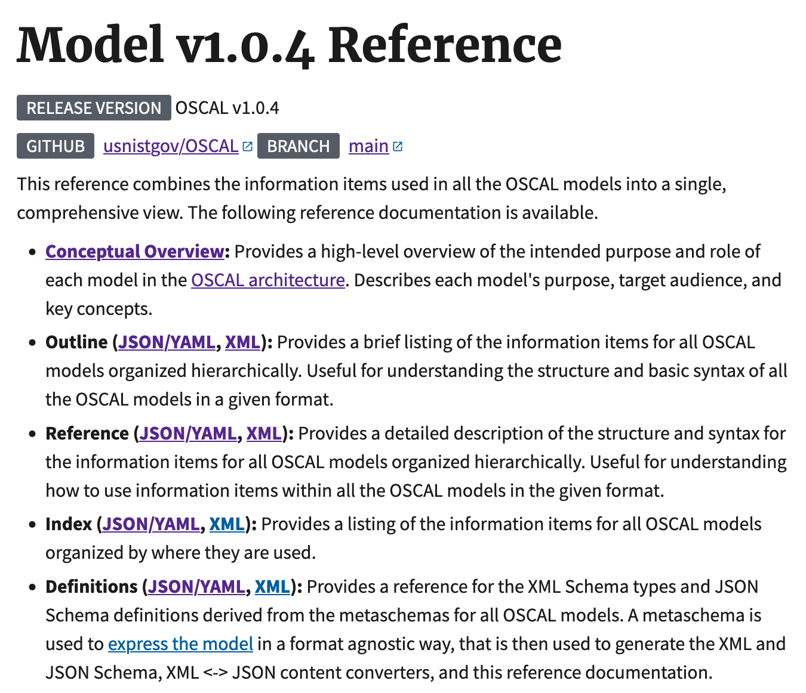
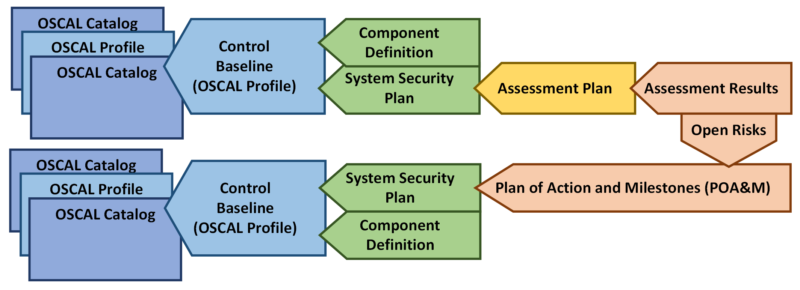

<!-- _paginate: false -->

# How do I OSCAL?
### 4th Annual OSCAL Conference Workshop
A.J. Stein & Nikita Wootten

<!--
Slide headings prefixed by an emoji follow the following legend:
- 🧩: This slide is an overview of a model
- 📝: This slide contains a live demonstration
-->

---

## ⚠️ Disclaimer

<!-- _class: workshop invert radialbg -->

All persons and organizations mentioned within this presentation are fictional and any resemblance to actual persons or organizations is unintended.

<!-- TODO: NIST disclaimer? -->

---

## Introduction

- [Who is the target audience of this talk?](#target-audience)
- [What are the key assumptions made for this talk?](#assumptions)
- [Who are we?](#who-are-we)
- [Environment setup](#environment-setup)

---

### Target audience

In order to follow along we assume that you:

1. Basic experience writing code or data (JSON, XML, YAML) in text editors
1. Understanding of security requirements for your business or mission
1. Understanding of your system and the larger context of your projects


---

### But I'm not the target audience!

We also assume you may not have these experiences.

* "But I've never been a developer!"
* "But I've never been an assessor!"
* "But I've never done governance, risk, or compliance work at my job!"

---

### But I'm not the target audience! (continued)

That is OK, we are very happy you're here!

* In the present or future, you will use compliance and security tools that use OSCAL.
* Shared specifications may standardize information and behavior for multiple tools from different vendors.
* Changed tools and processes will impact your organization and work.

---

<!--
_footer: " How do I OSCAL? - 4th Annual OSCAL Conference Workshop"
_class: workshop shrink
-->

### Environment setup


In order to follow along you need:

1. A computer (macOS or Windows, Linux, patched and updated)
    - ⚠️ Windows users will require the [WSL backend](https://learn.microsoft.com/en-us/windows/wsl/install)
1. [Visual Studio Code](https://code.visualstudio.com/#alt-downloads)
1. [Docker Desktop](https://www.docker.com/products/docker-desktop/) if on macOS or Windows, [Docker Engine](https://docs.docker.com/engine/) if on Linux

📝 You do not have to follow along to learn from this presentation.

---

### Assumptions

<!-- _class: workshop invert radialbg -->

The goal of this presentation is to demonstrate *a* workflow showcasing how OSCAL and a GRC service *could* interact within your organization.

---

### Who are we?

<!-- TODO include some icons here -->

* Developer - Developing the application
* System Engineer - Deploying and maintaining the application in the system

---

## The opening act (why are we here?)

Our fictional organization, IFA, wants the GoodRead product team to use OSCAL on this new project and report back on how it improves the project lifecycle.



We have been tasked with designing and documenting this new system.

---

### The project

- Important Federal Agency needs a link shortener (let's call it **IFA GoodRead**)
- How will it work?
    - Staff log into GoodRead admin portal
    - Take a URL like `https://www.ifa.gov/2023/04/19/request-for-comment-on-new-guidance-for-2023-fiscal-year`
    - Generate a short link like `https://from.ifa.gov/2023rfc`
    - Share short link with public
    - Track audience metric from short link usage

---

## The valley of despair

- IFA has lots of mandatory policies and recommended processes
- Projects must start, change, or stop through the IFA SDLC
- Not just developers and engineers create and manage a system:
    - Technical and non-technical staff must frequently collaborate
    - They write about what they have and do in the project
    - They have to keep documentation current in long SDLC phases

---

## The valley of despair (continued)

* How did they do it before?
    - Staff created Microsoft Word and PDF documents
    - Colleagues reviewed individually, made comments, emailed draft feedback
    - Frequent meetings occurred to clear up ambiguities in documents
* Why didn't they like it before?
    - Data was unstructured and hard to manage
    - Quality checking across multiple related documents was labor intensive
    - Quick spot check of system development or operation difficult

---

## The valley of despair (continued)

IFA staff were not so happy.

---


## Leaving the valley of despair (continued)

* How will the IFA GoodRead Team do now?
    - They built a GRC program with a centralized service
    - Staff use web application or APIs
    - Little reliance on Microsoft Word or PDF documents
* What does the IFA CISO office expect to happen now?
    - GRC service has structured data for efficient analysis
    - Most quality checking is done by GRC
    - GRC indicates status or progress on the system lifecyle

---

## The valley of despair (continued)

IFA staff are a little happier now.

---

## How could we leverage OSCAL as developers?

Although *each organization will use OSCAL differently*, it provides some key benefits:

- Developers can document systems with code, with all the benefits of modularization.
- GRC tools and services can exchange data with standard data models.
- Vendors can provide security information about their products in components.

<!--
TODO: Create the following slides:
How do those roles collaborate with OSCAL? (*a* way they interact, this is not prescriptive)
    1. Developers write SSP store in VCS (GitHub)
    1. VCS copy of SSP uploaded to GRC tool
    1. ISSM reviews in GRC tool
    1. During assessment, assessors send AP to AO/ISSM/developer
    1. Devs submit evidence to assessors in AR against AP in GRC tool
-->

---

## Let's try OSCAL

*A potential* OSCAL workflow framed within an *SDLC process*: 

1. **Prepare** the project and its system
1. **Categorize** the system's data
1. **Select** controls for the system
1. **Implement** the system and its security
1. **Assess** system's security
1. **Authorize** the system for operation
1. **Monitor** the system

---

## Let's try OSCAL (continued)

1. **Prepare** the project and its system
    * Bootstrap OSCAL files with preparatory info
2. **Categorize** the system's data
    * Add system information types in OSCAL SSP
    * Add system categorization in OSCAL SSP

---

## Let's try OSCAL (continued)

3. **Select** controls for the system
    * Retrieve import profile for OSCAL SSP to identify selected controls
    * Generate resolved OSCAL catalog from OSCAL profile
4. **Implement** the system and its security
    * Add "this system" component in OSCAL SSP
    * Add control implementation in OSCAL
---

## Let's try OSCAL (continued)

5. **Assess** system's security
    * Retrieve OSCAL AP
    * Perform assessment activities in OSCAL AP
    * Create OSCAL AR documenting assessment activities, supporting evidence, and results
    * Upload OSCAL AR to GRC
    * Create OSCAL POA&M and upload to GRC
6. **Authorize** the system for operation
    * Retrieve updated OSCAL SSP with authorization data
    * Deploy system

---

## Let's try OSCAL (continued)

7. **Monitor** the system
    * Review OSCAL POA&M and check if findings obsolete
    * Retrieve OSCAL AP for continuous monitoring steps
    * Perform continuous monitoring activities
    * Create OSCAL AR documenting activities, supporting evidence, and results
    * Create and update OSCAL POA&M if needed
---

<!--
_footer: " How do I OSCAL? - 4th Annual OSCAL Conference Workshop"
_class: workshop whitebg
-->

### OSCAL basics

OSCAL describes a set of *models* for documenting a system in machine readable formats (JSON, XML, YAML).


---

<!--
_footer: " How do I OSCAL? - 4th Annual OSCAL Conference Workshop"
_class: workshop whitebg
-->

#### How do we edit OSCAL content?



- Refer to the [OSCAL model documentation](https://pages.nist.gov/OSCAL/reference/latest/complete/) (pictured)
- Configure your editor to use OSCAL's [JSON/YAML](https://github.com/usnistgov/OSCAL/tree/d3a2b990e24210c253642451e30ea6db99bd045b/json/schema) and [XML](https://github.com/usnistgov/OSCAL/tree/d3a2b990e24210c253642451e30ea6db99bd045b/xml/schema) **schemas**.
    - ⚠️ OSCAL imposes additional constraints not represented within the schemas.

---

<!--
_footer: " How do I OSCAL? - 4th Annual OSCAL Conference Workshop"
_class: workshop whitebg
-->

#### Leveraging OSCAL tooling

OSCAL tools, such as the [OSCAL-CLI](https://github.com/usnistgov/oscal-cli), provide additional functionality:

- Converting documents between formats (JSON, YAML, XML)
    ```
    $ oscal-cli profile convert basic-profile.json basic-profile.xml
    ```

- Validating OSCAL documents
    ```
    $ oscal-cli profile validate basic-profile.json
    ```

- Performing specific OSCAL operations (profile resolution)
    ```
    $ oscal-cli profile resolve basic-profile.json
    ```

---

### Prepare


---

### Categorize


---

### Categorize (continued)


---

<!--
_footer: " How do I OSCAL? - 4th Annual OSCAL Conference Workshop"
_class: workshop whitebg
-->

#### 🧩 The OSCAL system security plan (SSP) model


> An SSP describes the control implementation of an information system.

---

#### 📝 Our basic SSP

[🔗 appendix slides](#appendix-a-our-starter-ssp)

<!--
Note: Live demo here

Create the basic SSP
-->

---

### Categorize (continued)


---

### Select controls


---

<!--
_footer: " How do I OSCAL? - 4th Annual OSCAL Conference Workshop"
_class: workshop whitebg
-->

#### 🧩 The OSCAL catalog model


> A catalog describes a collection of security controls and related control enhancements, along with contextualizing documentation and metadata.

---

<!--
_footer: " How do I OSCAL? - 4th Annual OSCAL Conference Workshop"
_class: workshop whitebg
-->

#### 🧩 The OSCAL profile model


> A profile designates a selection and configuration of controls from one or more catalogs, along with a series of operations over them.

---

#### 📝 Our profile

<!--
Note: Live demo here

- Create a profile with our control selection
- Resolve the profile and examine the output catalog (if time permits)
- Update the SSP to use the new profile
-->

[🔗 appendix slides](#appendix-b-our-profile)

---

### Implement


---

#### IFA GoodReads: Defining the system


---

#### 📝 Our updated system security plan

<!--
Note: Live demo here

Update the SSP with our systems
-->

[🔗 appendix slides](#appendix-c-our-updated-system-security-plan)

---

### Assess: Plan


---

<!--
_footer: " How do I OSCAL? - 4th Annual OSCAL Conference Workshop"
_class: workshop whitebg
-->

#### 🧩 The OSCAL assessment plan model


> An assessment plan describes the information typically provided by an assessor during the preparation for an assessment.

---

#### 📝 Our assessment plan

<!--
Note: Live demo here

Create our basic assessment plan
-->

[🔗 appendix slides](#appendix-d-our-assessment-plan)

---

### Assess: generate results


---

<!--
_footer: " How do I OSCAL? - 4th Annual OSCAL Conference Workshop"
_class: workshop whitebg
-->

#### 🧩 The OSCAL assessment results model


> An assessment results document describes the information typically provided by an assessor following an assessment.

---

#### 📝 Our assessment results

<!--
Note: Live demo here

Go through an already created assessment results file
-->

[🔗 appendix slides](#appendix-e-our-assessment-results)

---

<!--
_footer: " How do I OSCAL? - 4th Annual OSCAL Conference Workshop"
_class: workshop whitebg
-->

#### 🤖 Opportunity for automation

<!--
The astute among you may be thinking: "I could generate evidence for assessment results in CI/CD pretty easily."

We agree! In a separate presentation we have explored this idea with a small GitHub actions workflow that generated assessment results automatically.
-->


Evidence generation for assessment results can be [automated with OSCAL](https://github.com/usnistgov/blossom-case-study).

---

### Assess: Generate Plan of Action and Milestones (POA&M)


---

<!--
_footer: " How do I OSCAL? - 4th Annual OSCAL Conference Workshop"
_class: workshop whitebg
-->

#### 🧩 The OSCAL plan of actions & milestones (POA&M) model


> A POA&M document describes the information typically provided by an assessor during the preparation for an assessment.

---

#### 📝 Our plan of action and milestones

<!--
Note: Live demo here

Create the POA&M
-->

[🔗 appendix slides](#appendix-f-our-plan-of-action-and-milestones)

---

### Assess: Finishing touches


---

### Authorize


---

### Continuously monitor


---

<!--
_footer: " How do I OSCAL? - 4th Annual OSCAL Conference Workshop"
_class: workshop whitebg
-->

#### 🌊 The flow of information
The models build on one-another iteratively



---

### Making OSCAL documents reusable


Our organization uses a lot of the same pieces across all of our applications (*AwesomeCloud Compute Server*, *Postgres*, etc)

How do we reuse the systems in other deployments?

---

<!--
_footer: " How do I OSCAL? - 4th Annual OSCAL Conference Workshop"
_class: workshop whitebg
-->

#### 🧩 The OSCAL component definition (CDEF) model


> A component definition describes the implementation of controls in a component or a set of components (technical or procedural) grouped as a capability.

*⚠️ NOTE: enhancements to the CDEF model are slated for future work*

---

#### 📝 Breaking our SSP into component definitions

<!--
Note: Live demo here

Create the CDEF, update the SSP to use the CDEF
-->

[🔗 appendix slides](#appendix-g-breaking-our-ssp-into-component-definitions)

---

<!-- _class: workshop invert radialbg -->

## What have we learned?

* 🧩 All of the OSCAL models and how they relate to one-another
* 📝 The basics of editing and validating OSCAL documents
* 🔍 Describing systems, security documentation, and assessment data with OSCAL

---

# 📚 Appendix

- [A](#appendix-a-our-starter-ssp): Our starter system security plan
- [B](#appendix-b-our-profile): Our profile
- [C](#appendix-c-our-updated-system-security-plan): Our updated system security plan
- [D](#appendix-d-our-assessment-plan): Our assessment plan
- [E](#appendix-e-our-assessment-results): Our assessment results
- [F](#appendix-f-our-plan-of-action-and-milestones): Our plan of action and milestones
- [G](#appendix-g-breaking-our-ssp-into-component-definitions): Breaking our system security plan into component definitions

---

<!-- Footer excluded from remaining slides due to content -->
<!--footer: "" -->

## Appendix A: Our starter SSP

Let's start with a skeleton of an SSP and fill in some metadata:

```xml
<system-security-plan
  uuid="cff8385f-108e-40a5-8f7a-82f3dc0eaba8"
  xmlns="http://csrc.nist.gov/ns/oscal/1.0">
  <metadata>
    <title>IFA GoodReads SSP</title>
    <last-modified>2023-05-16T13:57:28.355446-04:00</last-modified>
    <version>1.0</version>
    <oscal-version>1.0.4</oscal-version>
    <!-- Must populate roles and parties -->
  </metadata>
  <!-- To fill in: -->
  <import-profile></import-profile>
  <system-characteristics></system-characteristics>
  <system-implementation></system-implementation>
  <control-implementation></control-implementation>
</system-security-plan>
```

---

### Appendix A.i: Our starter SSP's roles and parties

We use `<role>` and `<party>` in `<metadata>` to document the kinds of work in a project, the people who do it, and the organization they work for.


```xml
...
<role id="owner"><title>IFA GoodRead Owner</title></role>
<role id="developer"><title>IFA GoodRead Developer</title></role>
<role id="system-engineer"><title>IFA GoodRead System Engineer</title></role>
<role id="public-affairs-office"><title>IFA Public Affairs Office</title></role>
<party uuid="ba9c12bd-e5ef-46b6-95a2-4d8e7f864c1a" type="person">
    <name>Owen Owner</name>
    <member-of-organization>3a675986-b4ff-4030-b178-e953c2e55d64</member-of-organization>
</party>
<party uuid="67c04291-dbf6-495a-a3ba-0011638acc94" type="person">
    <name>Nikita Wootten</name>
    <member-of-organization>3a675986-b4ff-4030-b178-e953c2e55d64</member-of-organization>
</party>
<party uuid="4ba3f2b7-e894-48d7-b940-91c68661df55" type="person">
    <name>A.J. Stein</name>
    <member-of-organization>3a675986-b4ff-4030-b178-e953c2e55d64</member-of-organization>
</party>
<party uuid="3a675986-b4ff-4030-b178-e953c2e55d64" type="organization">
    <name>Important Federal Agency</name>
    <short-name>IFA</short-name>
    <link href="https://www.ifa.gov" rel="website"/>
</party>
<responsible-party role-id="owner">
    <party-uuid>ba9c12bd-e5ef-46b6-95a2-4d8e7f864c1a</party-uuid>
</responsible-party>
<responsible-party role-id="developer">
    <party-uuid>67c04291-dbf6-495a-a3ba-0011638acc94</party-uuid>
</responsible-party>
<responsible-party role-id="system-engineer">
    <party-uuid>4ba3f2b7-e894-48d7-b940-91c68661df55</party-uuid>
</responsible-party>
```

---

### Appendix A.ii: Our starter SSP's system characteristics

```xml
...
<system-characteristics>
    <system-id identifier-type="http://ietf.org/rfc/rfc4122">
        8101e04d-8305-4e73-bb95-6b59f645b143
    </system-id>
    <system-name>IFA GoodReads</system-name>
    <description>
        <p>This system acts as a link shortener for IFA employees</p>
    </description>
    <security-sensitivity-level>moderate</security-sensitivity-level> <!-- Determined by categorization -->
    <system-information>
        <!-- Detailed information types (next slide) -->
    </system-information>
    <security-impact-level> <!-- Determined by categorization -->
        <security-objective-confidentiality>low</security-objective-confidentiality>
        <security-objective-integrity>medium</security-objective-integrity>
        <security-objective-availability>low</security-objective-availability>
    </security-impact-level>
    <status state="under-development"></status>
    <authorization-boundary>
        <description>
            <p>This components deployed on AwesomeCloud</p>
        </description>
    </authorization-boundary>
</system-characteristics>
```

---

### Appendix A.iii: Our starter SSP's system information types

In `<system-information>` we document the information types (as defined in [FIPS-199](https://nvlpubs.nist.gov/nistpubs/fips/nist.fips.199.pdf)) present in the system.

```xml
...
<system-information>
    <information-type>
        <title>User-provided Links</title>
        <description>
            <p>This system maintains a set of user-provided links and their associated shortlinks</p>
        </description>
        <categorization system="https://doi.org/10.6028/NIST.SP.800-60v2r1">
            <information-type-id>C.2.8.12</information-type-id>
        </categorization>
        <confidentiality-impact>
            <base>fips-199-low</base>
        </confidentiality-impact>
        <integrity-impact>
            <base>fips-199-low</base>
            <selected>fips-199-moderate</selected>
            <adjustment-justification>
                <p>Maliciously modified links are a concern</p>
            </adjustment-justification>
        </integrity-impact>
        <availability-impact>
            <base>fips-199-low</base>
        </availability-impact>
    </information-type>
</system-information>
```

---

### Appendix A.iv: Our starter SSP (conclusion)

In this demonstration we have:
- Created a minimal SSP in OSCAL
- Discussed the `<metadata>` object
- Documented our system's `roles` and `parties`
- Documented the information types in our system and their categorization

⚠️ The SSP in its current state is invalid! We must fill it out with information given in later steps.

[⏪ Back to the presentation](#our-basic-ssp)

---

## Appendix B: Our profile

Profiles import and tailor controls from one or more catalogs.

```json
{
    "profile": {
        "uuid": "ada8fb2f-ba03-46b6-a695-35763beed453",
        "metadata": {
            "title": "IFA GoodReads Profile",
            "last-modified": "2023-05-17T13:57:28.355446-04:00",
            "version": "1.0",
            "oscal-version": "1.0.4"
        },
        "imports": [
            {
                // URL shortened for brevity (if only we had a link shortener!)
                "href":
"https://raw.githubusercontent.com/.../NIST_SP-800-53_rev5_MODERATE-baseline-resolved-profile_catalog.json",
                "include-controls": [
                    {
                        "with-ids": [
                            "ac-6.1"
                        ]
                    }
                ]
            }
        ],
        "merge": {
            "flat": {}
        }
    }
}
```

---

### Appendix B.i: Our profile can be resolved into a catalog

Through a process known as *profile resolution*, profile authors can turn a profile into a *resolved catalog*:

```
oscal-cli profile resolve profile.oscal.json
```

Which produces:

```json
{
    "catalog" : {
        "uuid" : "30013927-fb24-4e03-bc15-8d9df5e17a25",
        "metadata" : {
            "title" : "IFA GoodReads Profile"
            // ...
        },
        "controls": [ {
            "id": "ac-6.1",
            "class" : "SP800-53-enhancement",
            "title" : "Authorize Access to Security Functions",
            "params" : [ {
                "id" : "ac-6.1_prm_2",
                "label" : "organization-defined security functions (deployed in hardware, software, and firmware)"
            // ... rest of the control omitted
}]}]}} // sorry
```

---

### Appendix B.ii: Our profile can be imported by our SSP

Our SSP imports the profile we just created:

```xml
<system-security-plan
    uuid="cff8385f-108e-40a5-8f7a-82f3dc0eaba8"
    xmlns="http://csrc.nist.gov/ns/oscal/1.0">
    ...
    <import-profile href="./profile.oscal.json"/>
    ...
</system-security-plan>
```

📝 Notice that the SSP and profiles use JSON and XML interchangeably.

---

### Appendix B.iii: Our profile (conclusion)

In this demonstration we have:
- Created a profile with our selected controls
- Explored profile resolution and the process of creating a "resolved catalog"
- Demonstrated OSCAL's inter-format compatibility
- Updated our SSP to import the profile

⚠️ The SSP is still incomplete and missing crucial details about our system. We will finish creating the SSP in the next step.

[⏪ Back to the presentation](#our-profile)

---

## Appendix C: Our updated system security plan

Our system security plan is missing crucial details about our system, namely:
- `<system-implementation>`: Define how the system is implemented
    - `<user>`*s*: Define the users that interact with a system based on an associated `<role>`
    - `<component>`*s*: Define the components that make up an implemented system
- `<control-implementation>`: Describes how the system satisfies a set of controls

---

### Appendix C.i: Our updated system security plan's system users

The first user type of our system is the general public, who are free only to view a shortlink.

```xml
...
<system-implementation>
    <user uuid="fb36760a-143d-490b-8fc4-6a8c172fba86">
        <title>General Public</title>
        <description>
            <p>The general public is free to click on shortlinks</p>
        </description>
        <authorized-privilege>
            <title>General Public Privilege</title>
            <function-performed>shortlink-view</function-performed>
        </authorized-privilege>
    </user>
</system-implementation>
```

---

### Appendix C.ii: Our updated system security plan's system users (continued)

```xml
...
<user uuid="00d323d3-dc3f-4d93-900f-f13430e094d3">
    <title>Application Administrator</title>
    <description>
        <p>The developer of the application supports IFA Public Affairs Officers by
        administering the application and its infrastructure.</p>
    </description>
    <role-id>developer</role-id>
    <authorized-privilege>
        <title>Application Administrator Privilege</title>
        <function-performed>user-creation</function-performed>
        <function-performed>user-enablement</function-performed>
        <function-performed>user-disablement</function-performed>
        <function-performed>user-role-modification</function-performed>
        <function-performed>popular-shortlink-cache-reset</function-performed>
        <function-performed>database-export</function-performed>
        <function-performed>database-migration</function-performed>
    </authorized-privilege>
</user>
<user uuid="61405ba7-edb4-4243-8461-79aac5805e5c">
    <title>Public Affairs Officers</title>
    <description>
        <p>IFA Public Affairs Officers (PAOs) in each division of the agency review public communications to citizens who are customers of the IFA.
        PAOs review requests from colleagues to generate and publish content that is the target of a shortlink and can un-publish shortlinks.</p>
    </description>
    <role-id>public-affairs-office</role-id>
    <authorized-privilege>
        <title>Public Affairs Officer Privilege</title>
        <function-performed>shortlink-generation</function-performed>
        <function-performed>shortlink-approval</function-performed>
        <function-performed>shortlink-rejection</function-performed>
        <function-performed>shortlink-publication</function-performed>
        <function-performed>shortlink-unpublication</function-performed>
    </authorized-privilege>
</user>
```

---

### Appendix C.iii: Our updated system security plan's system component

For now, let's define our system as a single component.

```xml
...
<component uuid="551b9706-d6a4-4d25-8207-f2ccec548b89" type="this-system">
    <title>IFA GoodReads system</title>
    <description>
        <p>The IFA GoodReads link shortener system</p>
    </description>
    <status state="under-development"/>
    <protocol name="https">
        <port-range start="443" end="443" transport="TCP"/>
    </protocol>
    <protocol name="ssh">
        <port-range start="22" end="22" transport="TCP" />
    </protocol>
</component>
```

---

### Appendix C.iv: Our updated system security plan's system inventory

TODO

---

### Appendix C.v: Our updated system security plan's control implementation

TODO

---

### Appendix C.?: Our updated system security plan (conclusion)

In this demonstration we have:
- Documented our system using the `<system-implementation>` part of our SSP.
- Documented how our system implements controls using the `<control-implementation>` part of our SSP.

✅ Our SSP now adequately describes our system and is considered *valid*.

[⏪ Back to the presentation](#our-updated-system-security-plan)

---

## Appendix D: Our assessment plan

TODO

---

### Appendix D.?: Our assessment plan (conclusion)

In this demonstration we have:
- TODO

[⏪ Back to the presentation](#our-assessment-plan)

---

## Appendix E: Our assessment results

TODO

---

### Appendix E.?: Our assessment results (conclusion)

In this demonstration we have:
- TODO

[⏪ Back to the presentation](#our-assessment-results)

---

## Appendix F: Our plan of action and milestones

TODO

---

### Appendix F.?: Our plan of action and milestones (conclusion)

In this demonstration we have:
- TODO

[⏪ Back to the presentation](#our-plan-of-action-and-milestones)

---

## Appendix G: Breaking our SSP into component definitions

TODO

---

### Appendix G.?: Breaking our SSP into component definitions (conclusion)

In this demonstration we have:
- TODO

[⏪ Back to the presentation](#breaking-our-ssp-into-component-definitions)
